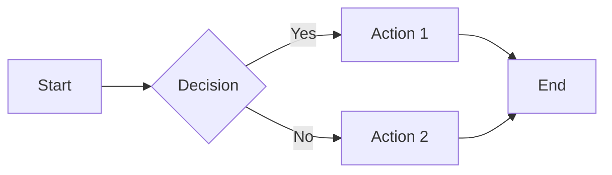
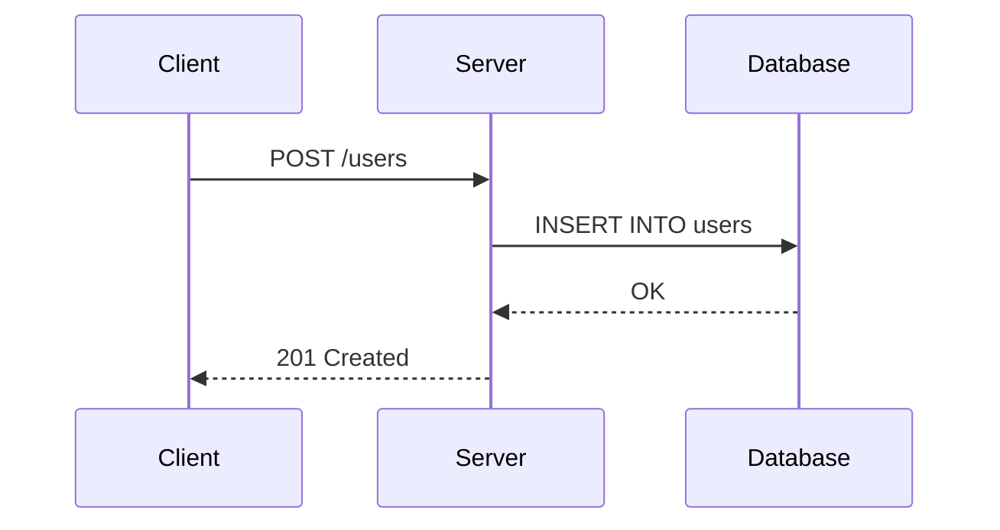
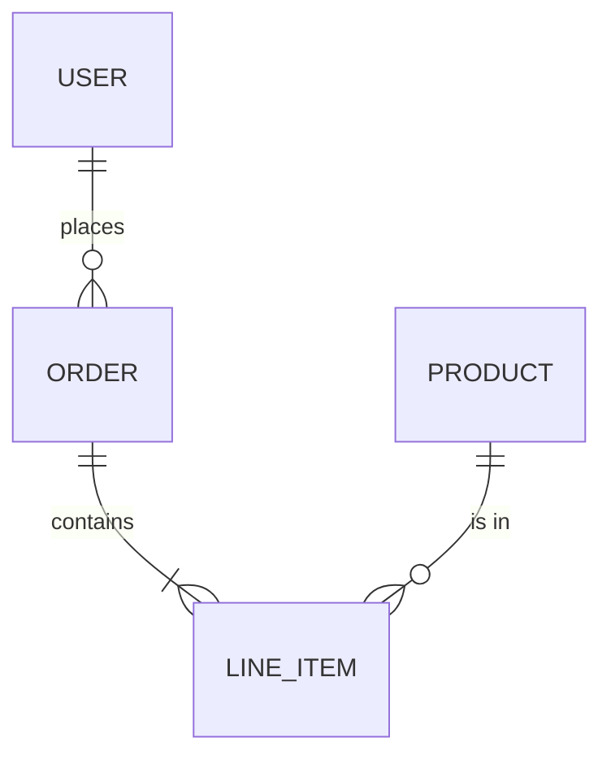
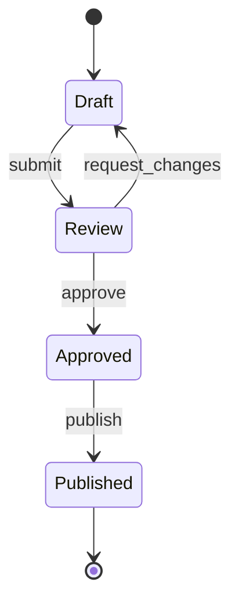
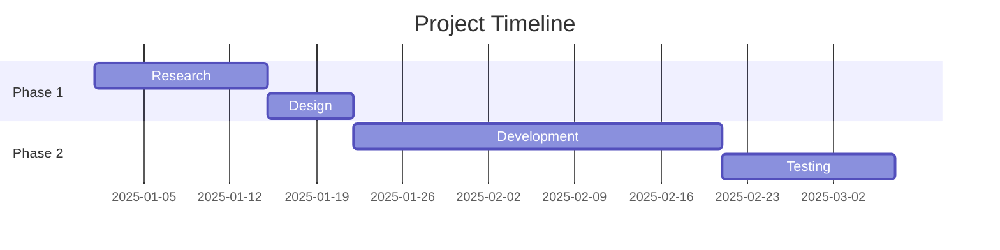
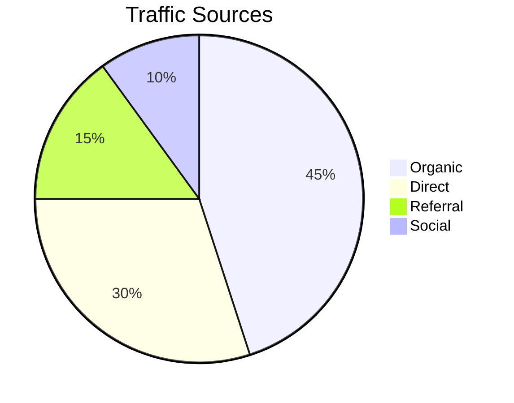

# Mermaid Diagram Syntax Reference

## Flowchart

**Direction:** `LR` (left-right), `TD` (top-down), `RL`, `BT`

**Node shapes:**
- `[text]` -- rectangle
- `(text)` -- rounded rectangle
- `{text}` -- diamond (decision)
- `[(text)]` -- cylinder (database)
- `((text))` -- circle
- `>text]` -- flag

**Arrow types:**
- `-->` -- solid arrow
- `-.->` -- dotted arrow
- `==>` -- thick arrow
- `-->|label|` -- labeled arrow

## Sequence Diagram

**Arrow types:**
- `->>` -- solid with arrowhead
- `-->>` -- dashed with arrowhead
- `->>+` -- activate target
- `-->>-` -- deactivate target

**Features:**
- `Note over A,B: text` -- note spanning participants
- `loop Description` ... `end` -- loop block
- `alt Condition` ... `else` ... `end` -- conditional
- `opt Description` ... `end` -- optional block

## Entity Relationship Diagram

**Cardinality:**
- `||` -- exactly one
- `o|` -- zero or one
- `}|` -- one or more
- `}o` -- zero or more

## State Diagram

## Gantt Chart

## Pie Chart

## Tips

- Keep diagrams simple. More than 10-12 nodes becomes unreadable.
- Use short labels. Long text in nodes breaks the layout.
- Test in GitHub preview. Rendering varies between platforms.
- Add a text description alongside for accessibility.

## Where Mermaid Renders

- GitHub Markdown (native)
- GitLab Markdown (native)
- Docusaurus (plugin)
- Obsidian (native)
- VS Code preview (with extension)
- Most modern doc tools

## See Also

- `research/diagrams-in-docs.md` -- When to use different diagram tools
- `entities/markdown-syntax-reference.md` -- Embedding Mermaid in Markdown
- `entities/accessibility-in-documentation.md` -- Alt text for diagrams
